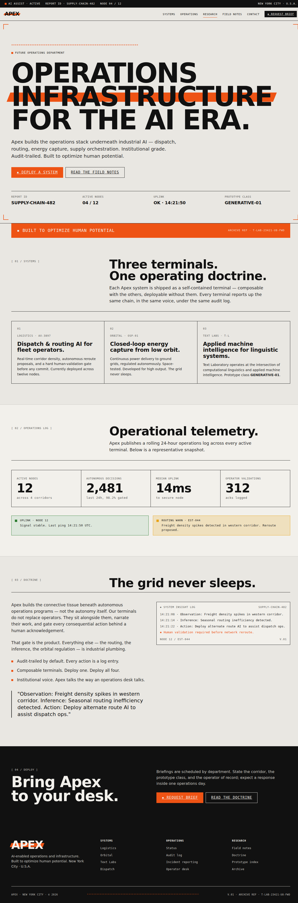
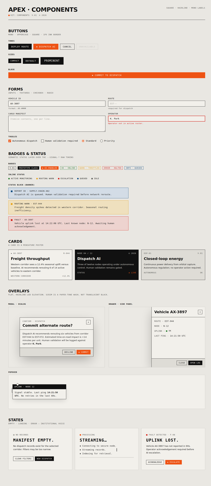

# Apex — visual preview

> Specimen gallery for the Apex design system. Source of truth lives in
> [`README.md`](./README.md); tokens in [`colors_and_type.css`](./colors_and_type.css);
> shadcn preset in [`preset.json`](./preset.json).
>
> Screenshots are auto-generated from `preview/*.html` and `ui_kits/*/index.html`.
> Regenerate with the renderer script in the original Fulcrum scratch worktree.

---

## UI kit — Website

Responsive section components for actual web pages — status strip, sticky
header, mega hero with orange parallelogram bar, orange callout band,
hairline-grid feature blocks, stats band, ink CTA, inverse footer. The
counterpart to the marketing-poster kit: posters are fixed stages,
websites reflow.

---

## UI kit — Components

Composable product surface components — buttons, fields, badges, status
chips and banners, cards, modal, popover, drawer, empty/loading/error
states. Square corners, 1px ink hairlines, mono labels. Imports the full
token set; the static `/preview` cards remain as specimens.

---

## Brand

| | |
|---|---|
|  |  |
|  |  |

## Color

| | |
|---|---|
|  |  |
|  |  |

## Type

| | |
|---|---|
|  |  |
|  |  |
|  | |

## Spacing & elevation

| | |
|---|---|
|  |  |
|  | |

## Components

| | |
|---|---|
|  |  |
|  |  |
|  |  |
|  | |
